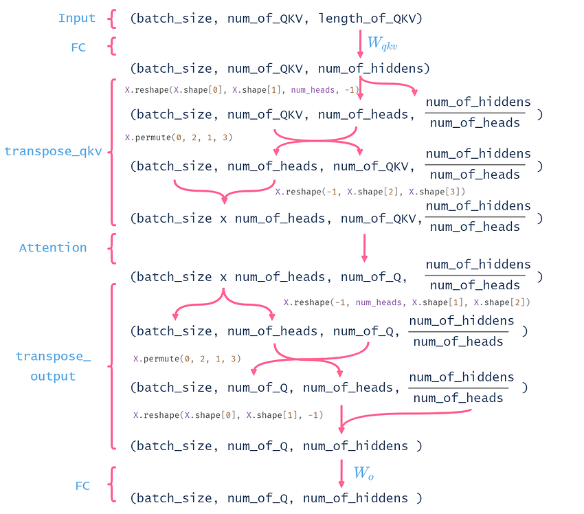

<!--
 * @Author: WHURS-THC
 * @Date: 2022-10-27 10:42:59
 * @LastEditTime: 2022-12-05 11:10:16
 * @Description: 
 * 
-->
# d2l-zh-pytorch

李沐《动手深度学习》_THC编辑
========================
<!-- 
```eval_rst
.. raw:: html
   :file: frontpage.html
``` -->

<!-- :begin_tab:toc
:end_tab: -->
## *前言*

- [chapter_preface/index](chapter_preface/index.ipynb)
- [chapter_installation/index](chapter_installation/index.ipynb)
- [chapter_notation/index](chapter_notation/index.ipynb)

## *正文*

- [chapter_introduction/index](chapter_introduction/index.ipynb)
- [chapter_preliminaries/index](chapter_preliminaries/index.ipynb)
- [chapter_linear-networks/index](chapter_linear-networks/index.ipynb)
- [chapter_multilayer-perceptrons/index](chapter_multilayer-perceptrons/index.ipynb)
- [chapter_deep-learning-computation/index](chapter_deep-learning-computation/index.ipynb)
- [chapter_convolutional-neural-networks/index](chapter_convolutional-neural-networks/index.ipynb)
- [chapter_convolutional-modern/index](chapter_convolutional-modern/index.ipynb)
- [chapter_recurrent-neural-networks/index](chapter_recurrent-neural-networks/index.ipynb)
- [chapter_recurrent-modern/index](chapter_recurrent-modern/index.ipynb)
- [chapter_attention-mechanisms/index](chapter_attention-mechanisms/index.ipynb)
- [chapter_optimization/index](chapter_optimization/index.ipynb)
- [chapter_computational-performance/index](chapter_computational-performance/index.ipynb)
- [chapter_computer-vision/index](chapter_computer-vision/index.ipynb)
- [chapter_natural-language-processing-pretraining/index](chapter_natural-language-processing-pretraining/index.ipynb)
- [chapter_natural-language-processing-applications/index](chapter_natural-language-processing-applications/index.ipynb)
- [chapter_appendix-tools-for-deep-learning/index](chapter_appendix-tools-for-deep-learning/index.ipynb)

## 参考

- [chapter_references/zreferences](chapter_references/zreferences.ipynb)

# 批注总结

## 2.1 ndarray

**广播机制**  
默认沿着长度为1的维广播  
如果只有1个轴，则在0维广播

## 3.5

**`data.DataLoader`**  
`data.DataLoader`返回类型不是`iteration`*迭代器*而是`torch.utils.data.dataloader.DataLoader` *可迭代的对象* 像是list  
因此需要先`iter()`转换为`iteration`

## 3.6

**mini-batch**  
小批量中每个样本是一行，即`输入(N,dim1)->输出(N,dim2)`

**`net.eval()`**  
当网络中有`dropout`/`batchnorm`的时候,需要使用`net.train()`&`net.eval()` `net.eval()`会关掉二者

  1. `dp` 由于网络已经训练完毕，参数都是固定的，因此每个min-batch的均值和方差都是无需再调整的，因此直接运用所有batch的均值和方差  
  2. `bn` 测试利用到了所有网络连接，即不进行随机舍弃神经元

**`*args` `**kwargs`**  

`*`tuple `**`dict (key=value)  
**打包（pack）**：函数定义时，`*args`是把多个位置参数打包成元组，`**kwargs`是把多个关键字参数打包成字典  
**拆分（unpack）**：函数调用时，`*args`是把打包了的参数拆成单个的，依次赋值给函数的形参，`**kwargs`是把字典的键值拆成单个的，依次赋值给函数的形参。

>args 是 arguments 的缩写，表示位置参数  
kwargs 是 keyword arguments 的缩写，表示关键字参数

## 4.1

即使是网络只有一个隐藏层，给定足够的神经元和正确的权重，
我们可以对任意函数建模

使用ReLU的原因是，它求导表现得特别好：要么让参数消失，要么让参数通过。
这使得优化表现得更好，并且ReLU减轻了困扰以往神经网络的梯度消失问题

## 4.2

`torch.optim.SGD(net.parameters(), lr=lr)`优化器必须需要使用`para.list()`而非`tensor`

## 4.4

将模型在训练数据上拟合的比在潜在分布中更接近的现象称为*过拟合*（overfitting）
用于对抗过拟合的技术称为*正则化*（regularization）

*训练误差*（training error）是指，模型在训练数据集上计算得到的误差。*泛化误差*（generalization error）是指，模型应用在同样从原始样本的分布中抽取的无限多数据样本时，模型误差的期望.

`欠拟合`训练误差和验证误差都很严重，但它们之间仅有一点差距。
`过拟合`训练误差明显低于验证误差。

1. 模型越复杂越容易过拟合
2. 数据集约小越容易过拟合

## 4.6

`nn.CrossEntropyLoss(reduction='none')` `reduction='none'`表示不取平均了,默认会取minibacth平均，（n,1）->(1,1)

## 4.8

**方差**  
>定义公式 $Var\left( X \right) =E\left( \left( X-E\left( X \right) \right) ^2 \right) =E\left( X^2 \right) -E\left( X \right) ^2$  

>计算公式 $Var\left( X \right) =\int{f_X\left( x \right) \left( X-E\left( X \right) \right) ^2dx}$

**`tensor.detach()`**  
 从计算图中脱离出来，返回一个新的tensor，新的tensor和原tensor共享数据内存，（这也就意味着修改一个tensor的值，另外一个也会改变），但是不涉及梯度计算。*在从tensor转换成为numpy的时候，如果转换前面的tensor在计算图里面（requires_grad = True），那么这个时候只能先进行detach操作才能转换成为numpy*

**K折交叉验证**  
K折交叉验证用于选取超参数；之后再在测试集进行测试。

## 5.1

**`nn`和`nn.function`中定义的函数如`nn.ReLU`和`F.relu`的差别**  

1. 前者是类，封装了后者，前者必须先定义，再调用对象
2. 官方建议：具有学习参数的如`conv2d,linear,batchnorm`和`dropout`采用前者；没有学习参数的如`activation func,maxpool`采用后者或前者；
3. 在使用的时候，建议在`__init__`中使用前者定义好，在`forward`中调用

## 5.2

**nn.Linear权重矩阵的转置**  
pytorch的`linear`层在进行矩阵乘法的时候把权重进行了转置,因此权重矩阵是在输出时是转置了的

**net.state_dict()**  
*`OrderedDict`为有序`dict`类，可以通过下标访问，但不可迭代，但和`dict`一样都可以通过`items()`方法转化为可迭代的`dict_items`类，进行for循环访问*

`net.state_dict()`返回全网络的`OrderedDict` 下标`weight` `bias`等  

**当网络类别是`nn.Sequential`类别时候，可以使用如下方式访问**  
`net[n]`为第n层的`nn.module`类的网络，包括`linear` `relu`  
`net[n].state_dict()`返回第n层的全网络的`OrderedDict` 下标`n.weight` `n.bias`等
`net[n].bias/weight`返回该层的`nn.parameter.Parameter`  
`net[n].bias/weight.data`进一步返回`tensor`值

## 6.3 padding and strides

**卷积计算**  
图像尺寸 $n$ 卷积核尺寸 $k$ 填充 $p$ 步幅为 $s$ 输出形状为  
>$\lfloor(n-k+p+s)/s\rfloor$  

如果我们设置了$p=h-1$则输出形状将简化为
>$\lfloor(n+s-1)/s\rfloor$

更进一步，如果输入的高度和宽度可以被垂直和水平步幅整除，则输出形状将为
>$n/s$

## 6.4

**`torch.cat()`与`torch.stack()`的区别**  
`cat()`在dim=n维度上进行拼接，其他维度必须相同  
`stack()`在新的dim=n维度上进行堆叠，所有维度必须相同

**`bias`的数量**  
`bias`和输出有关，即`bias`的数量等于输出通道的数量，因为卷积操作的会在输入数量的通道上进行求和，因此即使在每个输入通道上都有一个偏置，求和后相当于输出通道上了。

## 6.6

**`with torch.no_grad()`的作用**  
`model.eval()`依旧会生成计算图，占用显存，只是不使用计算图来进行反向传播  
`with torch.no_grad()`结构中不构建计算图，不跟踪梯度，节约显存  
因此在测试评估时使用`with torch.no_grad()`

## 7.5 batch-norm

**全连接层**  
应用在仿射变换和激活函数之间。

**卷积层**  
应用在卷积层后和激活函数之间。  
注意，每个对于m个样本，对每个输出通道的m\*p\*q个元素上执行BN。因为每个输出通道对应一组卷积核参数。(把每个输出通道类比成全连接层的一个特征元素，那么每一个输出通道对应的卷积核参数也类比成一个参数)

**广播机制**  
在多于2维的张量上做广播，广播的向量需要保持维度。
`mean = X.mean(dim=(0, 2, 3), keepdim=True)`  

## 8.2 language-models

**`@property`**  
`@property`装饰器会将方法转换为相同名称的只读属性,只能通过属性的方式来调用，即不能带括号。  
可以与所定义的属性配合使用，这样可以防止属性被修改。

```python
  @property
  def token_freqs(self):
      return self._token_freqs
```

这样类中定义的不建议访问的私有属性`_token_freqs`就变成了`token_freqs`，后者可以正常访问，但是却无法修改，这样就起到了保护的作用。  

**collections.Counter**  
高性能容量数据类型，类似字典，但是`value`是对应`key`的数量。
访问：通过`key`值索引数量  
创建：可以创建一个空的`Counter`之后,在空的`Counter`上进行一些操作。  
也可以创建的时候传进去一个**迭代器（数组，字符串，字典等）**

```python
c = Counter(['red','red','blue','blue'])# 传进数组
c = Counter({'red': 4, 'blue': 2})      # 传进字典
c = Counter(cats=4, dogs=8)             # 传进元组
```

## 8.4 rnn

**困惑度**  
e^交叉熵平均值，
xt取决于x1...xt-1，因此交叉熵表示为-log(P(xt|x1...xt-1));  
类似图像中-log(P(y|x)),此处的x表示输入图像，y表示图像类别的真值

## 8.5 rnn-scratch

**高维矩阵的乘法**  
最后2个维度按照2维矩阵乘法法则，其他维度保持不变。  
eg. [N,A,B]*[N,B,C]=[N,A,C]

## 9.1 GRU

**重置门（reset）更新门（update）**  

>$\mathbf{R}_t = \sigma(\mathbf{X}_t \mathbf{W}_{xr} + \mathbf{H}_{t-1} \mathbf{W}_{hr} + \mathbf{b}_r)$  
$\mathbf{Z}_t = \sigma(\mathbf{X}_t \mathbf{W}_{xz} + \mathbf{H}_{t-1} \mathbf{W}_{hz} + \mathbf{b}_z)$

**候选隐状态（candidate hidden state）**  
>$\tilde{\mathbf{H}}_t = \tanh(\mathbf{X}_t \mathbf{W}_{xh} + \left(\mathbf{R}_t \odot \mathbf{H}_{t-1}\right) \mathbf{W}_{hh} + \mathbf{b}_h)$

**隐状态**  
>$\mathbf{H}_t = \mathbf{Z}_t \odot \mathbf{H}_{t-1}  + (1 - \mathbf{Z}_t) \odot \tilde{\mathbf{H}}_t$

## 9.1 LSTM

**输入门（input） 遗忘门（forget） 输出门（output）**   

>$
\begin{aligned}
\mathbf{I}_t &= \sigma(\mathbf{X}_t \mathbf{W}_{xi} + \mathbf{H}_{t-1} \mathbf{W}_{hi} + \mathbf{b}_i),\\
\mathbf{F}_t &= \sigma(\mathbf{X}_t \mathbf{W}_{xf} + \mathbf{H}_{t-1} \mathbf{W}_{hf} + \mathbf{b}_f),\\
\mathbf{O}_t &= \sigma(\mathbf{X}_t \mathbf{W}_{xo} + \mathbf{H}_{t-1} \mathbf{W}_{ho} + \mathbf{b}_o),
\end{aligned}
$

**候选记忆元（candidate memory cell）**  
>$\tilde{\mathbf{C}}_t = \text{tanh}(\mathbf{X}_t \mathbf{W}_{xc} + \mathbf{H}_{t-1} \mathbf{W}_{hc} + \mathbf{b}_c),$

**记忆元**  
>$\mathbf{C}_t = \mathbf{F}_t \odot \mathbf{C}_{t-1} + \mathbf{I}_t \odot \tilde{\mathbf{C}}_t.$

**隐状态**  
>$\mathbf{H}_t = \mathbf{O}_t \odot \tanh(\mathbf{C}_t).$

## 9.6 encoder-decoder

**`raise NotImplementedError`**
在父类的方法中定义虚函数所用，如果子类不继承就会报错

## 9.7 seq2seq

**nn.RNN的返回值**  
`nn.GRU` `nn.RNN` `nn.LSTM`的返回值为`(output(每步的最后一层H),state(最后一步的所有层H))`大小分别为

1. output的形状:(num_steps,batch_size,num_hiddens)
2. state的形状:(num_layers,batch_size,num_hiddens)

**`tensor.permute()`**
张量维度位置置换

```python
X.permute(1, 0, 2)#01维度交换
```

**tensor.repeat()**
按维度复制，参数的个数，不能少于被操作的张量的维度的个数

```python
>>> a = torch.randn(4, 5)
>>> a.repeat(1,1,2,3).size()#参数的位置对应维度，大于维度的参数数量，从前面开始增加扩展新维度
torch.Size([1, 1, 8, 15])
```

## 10.2  nadaraya-waston

**`tensor.squeeze()`**
`squeeze(n)`压缩（减少）第n维  
`unsqueeze(n)`增加第n维  
类似`unsqueeze(n)`效果的还有直接在增加的维度处索引`None`
例如：`[None,None,:]`增加第 0 1 维度  

**数组索引**
数组索引时`True` `False`表示对应位置的数是否保留；数字表示索引哪个位置的数  
所以不能用01代替`bool`

## 10.4 bahdanau-attention

**有无attention的seq2seq差异**

1. **普通seq2seq模型**，每次时间步的输入是12最后-1维度的`cat`  
   训练时，翻译结果的词元直接喂入；预测时，第一个step喂入`<bos>`
   1. `embed_size`  嵌入层输出的词元特征向量
   2. `num_hiddens` 固定的Context：encoder最后step最终层
2. **加入atten的seq2seq模型**，每次时间步的输入12最后-1维度的`cat`  
   训练时，翻译结果的词元直接喂入；预测时，第一个step喂入`<bos>`
   1. `embed_size` 嵌入层输出的词元特征向量
   2. `num_hiddens` 变化的Context：注意力集中的输出，encoder在所有step的最终层隐状态，将作为注意力的key和value。查询q初始化为encoder最后step最终层，后续为上一个step的最终层隐状态。

## 10.5 multihead-attention

**并行计算**  
pq\*h=pk\*h=pv\*h=num_hiddens=p0  
原理来说应该设置h个单元数为p的linear，但是一个单元数为h*p的linear效果相同  
由于后续要采用缩放点积，因此pq=pk  
虽然pk=pv，但这不是必须的，只要满足key-value一对一即可  

并行多头注意力输出，把num_heads合并到batch_size维度，即0维度，且相邻batch的不同head，特征维度变成num_hiddens/h。即把不同的head当成了batch。

最后linear层计算输出时，先把多头注意力的输出在特征维度拼接，特征维度回到num_hiddens，再传入linear层。

